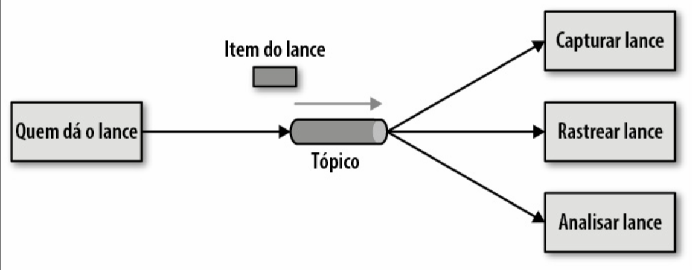

# Arquitetura baseada em Eventos

## Tópicos


[Install Azure CLI](https://learn.microsoft.com/en-us/cli/azure/install-azure-cli)

1. Realizar o login no Azure lindo ❤️, com a conta da UNIVILLE
```bash
az login
```

[Padrão de nomenclatura de recursos](https://learn.microsoft.com/pt-br/azure/cloud-adoption-framework/ready/azure-best-practices/resource-naming)

2. Como criar um grupo de recurso
```bash
az group create --name rg-das12025-test-brazilsouth --location brazilsouth
```

3. Como criar uma instancia do [Azure Service Bus](https://learn.microsoft.com/en-us/azure/service-bus-messaging/service-bus-messaging-overview)

```bash
az servicebus namespace create --resource-group rg-das12025-test-brazilsouth --name sb-das12025-test-brazilsouth --location brazilsouth --sku Standard
```
4. Criar o tópico
```bash
az servicebus topic create --resource-group rg-das12025-test-brazilsouth --namespace-name sb-das12025-test-brazilsouth --name topic-das1
```

5. Criar a Subscription
```bash
az servicebus topic subscription create --resource-group rg-das12025-test-brazilsouth --namespace-name sb-das12025-test-brazilsouth --topic-name topic-das1 --name subscription-walter
```

6. [Exemplo de código em Java](https://learn.microsoft.com/en-us/azure/service-bus-messaging/service-bus-java-how-to-use-topics-subscriptions?tabs=passwordless)